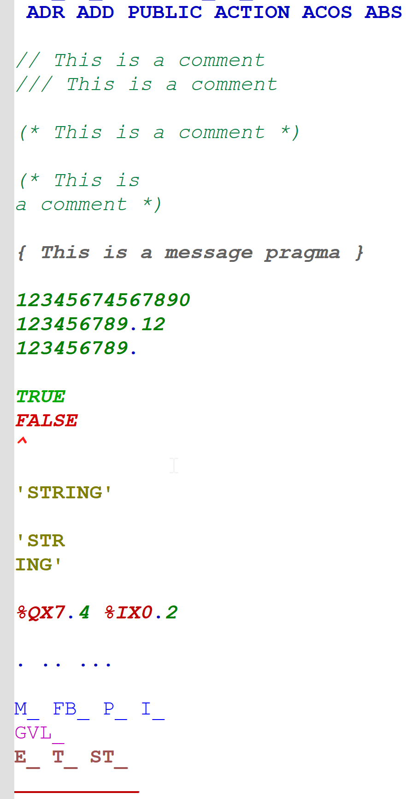

# structured-text-theme-for-notepad-plus-plus
A syntax highlighting theme for IEC 61131-3 Structured Text (ST) in Notepad++

# ST Light Theme for Notepad++

A clean and reserved syntax highlighting theme for IEC 61131-3 Structured Text, made for a light background in Notepad++.

The color scheme is close to the CODESYS V3 IDE style.

The keyword list is sourced from the official CODESYS Help documentation (https://content.helpme-codesys.com/en/CODESYS%20Development%20System/_cds_f_reference_programming.html).

## Installation

1.  Download the `Structured_Text_Theme_for_Notepad.xml` file from this repository.
2.  Open Notepad++.
3.  Navigate to the menu `Language -> User Defined Language -> Open User Defined Language folder...`.
4.  Place the downloaded `.xml` file into the opened folder.
5.  Restart Notepad++.
6.  The new language theme will be available in the `Language` menu.
